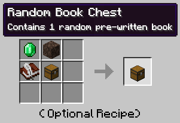

# Babel Book Loot v2.2.2


Babel Book Loot is a customizable Minecraft data pack that adds over 160 pre-written lore books to various loot tables. You can expand the library by adding your own books.

The pack is compatible with Minecraft 1.21.6 and likely works with older versions.


## Quick Start
1. **Download the Data Pack**: [Download babel_v2.2.2.zip](https://github.com/JiFish/babel/releases/download/v2.2.2/babel_v2.2.2.zip).
2. **Install**: Place the downloaded `.zip` file in your Minecraft world's `datapacks` directory.

## Gameplay Features
- **Book Sources**: Find books in village and stronghold chests, woodland mansions, fish them up, or get them from a librarian as a raid reward. The pack also introduces a new structure, the Lost Library, filled with book-related loot.
- **Books to be found**: Includes lore, mechanics, fiction, and more, written by "in-universe" authors.
- **Book Rarity**: You'll normally find books that are a "copy of a copy." But you'll rarely find books of other types.

### Testing

Books are supposed to be quite rare. If you want to test the data pack is installed correctly, you can try the following commands:

- Give yourself a random book: `/loot give @p loot babel:books`
- Find the nearest library (in a fresh world or area): `/locate structure babel:lost_library`

## Pre-Customized Versions
Additional variations of the pack offer tweaked mechanics:
- **[babel-bookish-zombies_v2.2.2.zip](https://github.com/JiFish/babel/releases/download/v2.2.2/babel-bookish-zombies_v2.2.2.zip)**: Zombies can drop books when killed by a player.
- **[babel-only-chests_v2.2.2.zip](https://github.com/JiFish/babel/releases/download/v2.2.2/babel-only-chests_v2.2.2.zip)**: Books are chest-exclusive (no fishing or raid reward).
- **[babel-no-libraries_2.2.2.zip](https://github.com/JiFish/babel/releases/download/v2.2.2/babel-no-libraries_v2.2.2.zip)**: Removes Lost Libraries.
- **[babel-fairytales_2.2.2.zip](https://github.com/JiFish/babel/releases/download/v2.2.2/babel-fairytales_v2.2.2.zip)**: Replaces lore books with public domain fairy tales.
- **[babel-recipe_v2.2.2.zip](https://github.com/JiFish/babel/releases/download/v2.2.2/babel-recipe_v2.2.2.zip)**: Adds the below crafting recipe for random books.
- **[babel-more-drops_v2.2.2.zip](https://github.com/JiFish/babel/releases/download/v2.2.2/babel-more-drops_v2.2.2.zip)**: Increases book weight in loot tables significantly. Also includes zombie book drops.



## Advanced Customization with Babel Builder
The Babel Builder tool lets you customize your pack further:

1. **Download the Tool**:
   - [babel-builder-windows_v2.2.2.zip](https://github.com/JiFish/babel/releases) (Windows)
   - [babel-builder-python_v2.2.2.zip](https://github.com/JiFish/babel/releases) (Python)
2. **Run the Tool**:
   - Windows: `babel.exe`
   - Python: `python babel.py`
3. **Install Output**: Place the generated `babel.zip` in your Minecraft world's `datapacks` directory.

### Customizing Books
Books are stored in the `lore_books` directory, which can be changed via the `books-path` setting in the configuration file.

Books can be written in JSON or YAML formats. For example:

#### YAML Example
```yaml
title: Sample Book
author: Some Author
pages:
  - This is page one.
  - This is page two.
  - This is page three.
```

#### JSON Example
```json
{
  "title": "Sample Book",
  "author": "Some Author",
  "pages": [
    "This is page one.",
    "This is page two.",
    "This is page three."
  ]
}
```

Minecraft accepts slightly non-standard JSON, and Babel does its best to handle these formats. To ensure proper formatting, write pages directly in Minecraft or use tools like [Text2Book](https://thewilley.github.io/Text2Book/).

### Optional Book Attributes
Books can include additional attributes:
- **`weight`**: Affects selection probability (default: `1`).
- **`lore`**: Adds lore text, similar to `pages`.
- **`custom_data`**: Adds custom NBT tags.

Example with optional parameters:
```json
{
  "title": "Another Sample Book",
  "author": "Some Author",
  "pages": ["Hello World!"],
  "weight": 2,
  "lore": [[{"text":"Lore line 1","color":"blue"}], "Lore line 2"],
  "custom_data": {"foo": "bar", "number": 16}
}
```

### Configurable Settings
Create your own config to:
- Disable specific loot drops.
- Adjust generation chances and loot table weights.
- Modify other pack settings.

Steps:
- Create `my_config.yaml`, and open in a text editor.
- Open `config.yaml`, and type any settings you want to change in to `my_config.yaml`.
- For example, add `output-filename: custom-babel.zip`.
- For any setting you do not specify, the value in `config.yaml` will be used as a fallback. See the other yaml files for examples.
- Run your config with `python babel.py my_config.yaml`.

### Full Command Options
```
usage: python babel.py [-h] [-v] [-i] [-t] [-a] [-c] [filename]

positional arguments:
  filename              Optional config filename. (default: config.yaml)

options:
  -h, --help            show this help message and exit
  -v, --version         show program's version number and exit
  -i, --indent          Indent output json files. Overrides config field.
  -m, -t, --metabox     Add test loot tables. Overrides config field.
  -a, --append-version  Append babel version number to output filename.
  -c, --chance-calc     Calculate real chances of various book generations and exit.
```

## Using with Other Data Packs
### Integrating Books into Other Packs
Add books to custom loot tables using:
```json
{
  "type": "minecraft:loot_table",
  "value": "babel:books"
}
```

If you just want to generate the loot table without the surrounding files, try running:

```bash
python build_loottable.py config.yaml > books.json
```

## Contributions
- Submit issues or suggestions on GitHub.
- Reach out via Mastodon: [@joe@social.jifish.co.uk](https://social.jifish.co.uk/@joe).

## Licensing
- Loot tables you generate with text you own are yours to use freely. A credit is appreciated but not required.
- Public domain books are sourced from [Project Gutenberg](https://www.gutenberg.org/).
- Babel tool and data pack are copyright Joseph Fowler.

## Disclaimer
Software is provided "as is," without warranty or liability. Use at your own risk.
